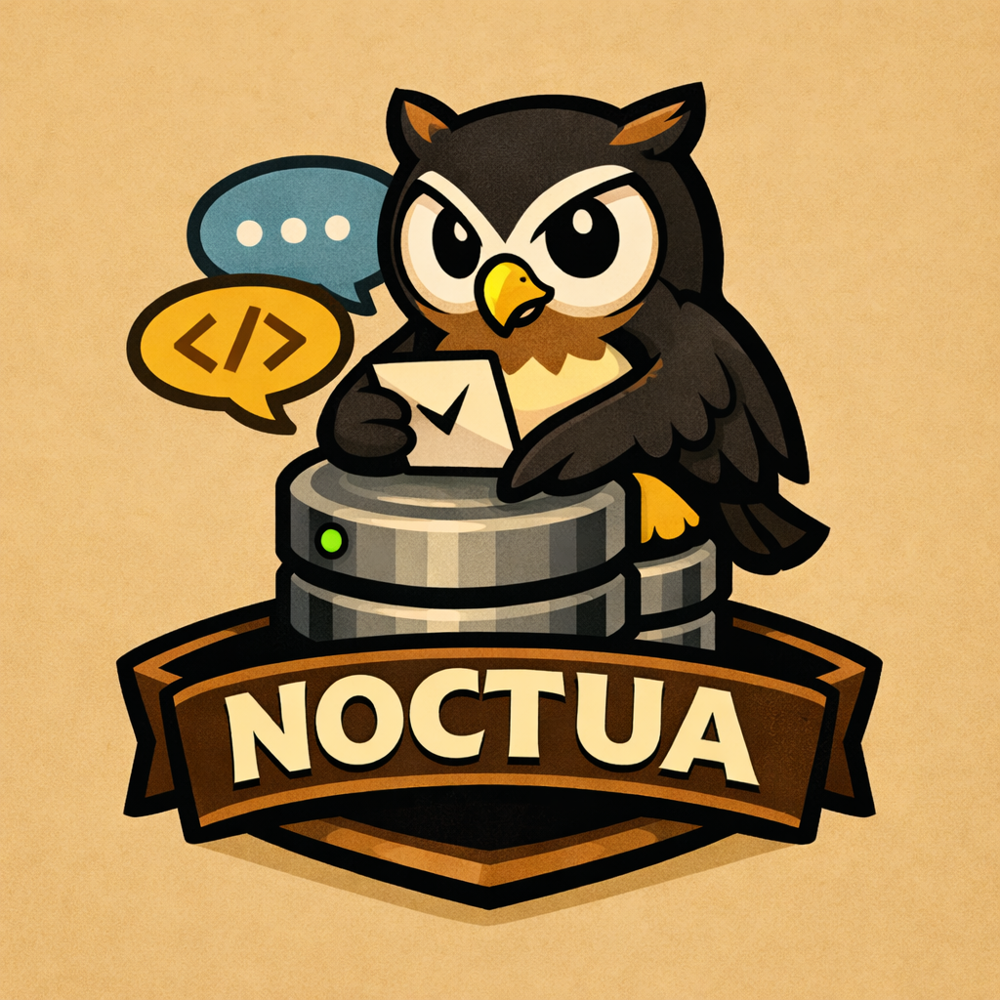

# **Noctua**

    

## **Information**
В данном брокере сообщений будет реализовываться такие ключевые аспекты:
* **Topics**: Поддержка именованных каналов для сообщений
* **Queues**: Внутри каждого топика будет существовать своя очередь
* **Persistence**: Будет реализовываться *Wall* like система журналирования с поддержанием offset внутри топика
## **Delivery guarantees**
На первых парах в брокере сообщений есть желание поддержать **At-Most-Once**, так как данная гарантия более совместимая с поддержанием **Wall**. Подтверждение от брокера будет, так как хочеться привязать такое действие к тому, что у нас будет 
## **Multithreading**
В данном брокере могу выделить вот такие ключевые <<атомарны>> действия, которые можно разнести по корутинам:
- **RPC-handler**: каждый отдельное сообщение можно будет получать в отдельной корутине и направлять её в нужный топик
- **Topics-handler**: так как топики не зависимы друг от друга, есть желание вынести их в отдельные корутины
- **Queue**: на первых порах есть желание просто взять *lock-free* очередь из Boost, но в дальнейшем думаю уйти к кастомному *wait-free* или если будет не так сложно *lock-free*
## **Technologies used**
- **Boost.Asio**
- **C+20** (вместе с корутинами)
- **function2** (больший совершенный std::function)
- **yaml-cpp** (для кастомного парсинга yaml)
